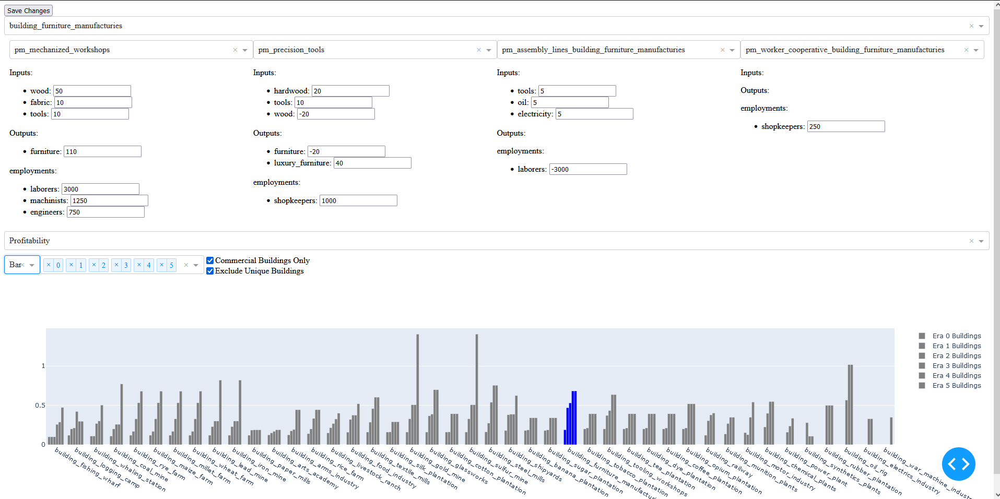
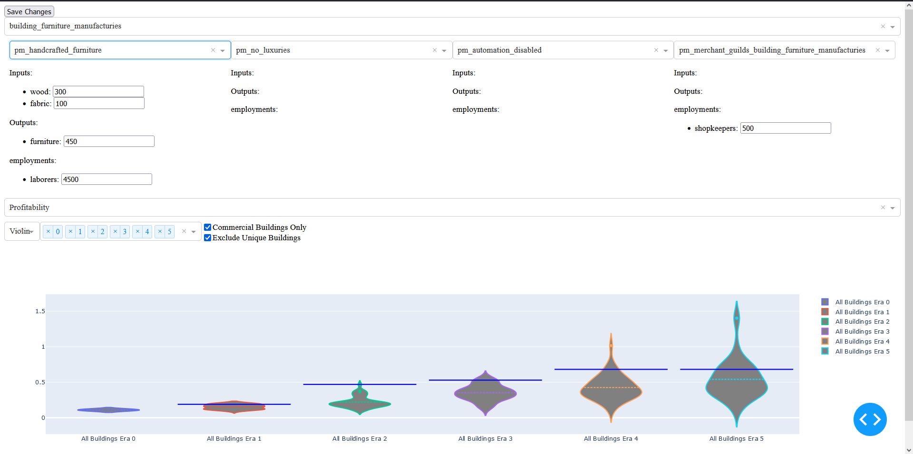
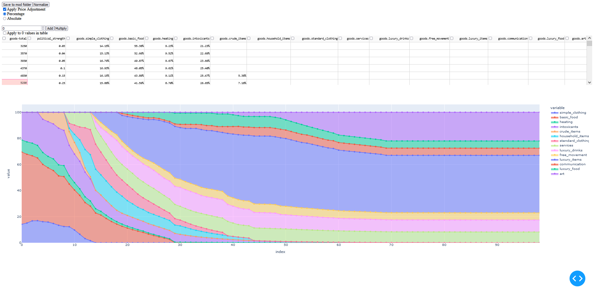

This is the public repository of Babylon Development focused on providing developers with tools to better mod Victoria games

To launch the software you require a:
 - python>=3.7

For the following steps you need to go to Victoria-3-dev-utilities folder and with a command prompt (windows) or terminal (other)

To install the requirements:
 - `python -m pip install -r requirements.txt`

To start simply run:
 - `python index.py`

go to the specified website in your favorite browser (usually http://127.0.0.1:8050/)

Please make an issue for any bugs you find.

### These are the current pages:
Building designer with profitability visualisation.

Pop needs adjuster with relative visualisation.

