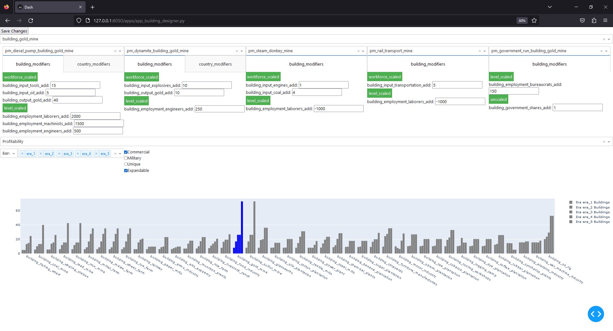
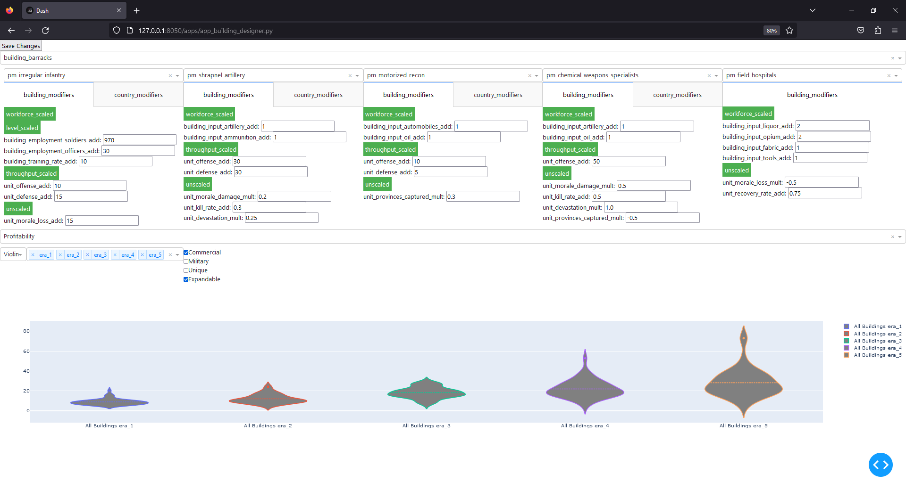
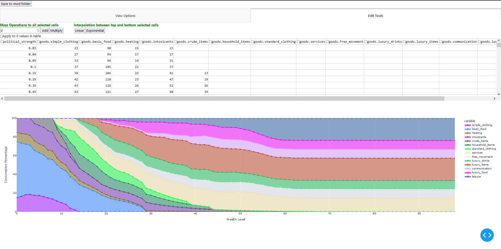
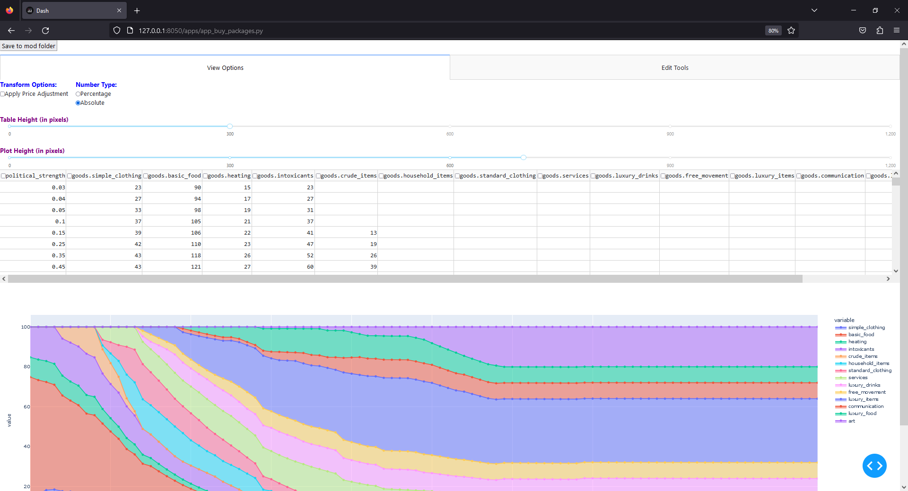

This is the public repository of Babylon Development focused on providing developers with tools to better mod Victoria games

The tool featured is developed in python and uses dash and plotly to visualise game data as you try and edit it within your browser. 

## Features:
- A save button which saves changed you made to your mod folder
- Visualisation of popneeds and building productivity
- An encoder and decoder which can read and generate the required paradox files
- Save from any state, pop_needs for example features a data change from absolute to percentages, the saved data will be free from those augmentations while reflecting all your changes.
- Load from mod, your data from your selected mod folder will be loaded in and shown to you instead of vanilla values.
  
## Limitations:
- no undo button, probably not gonna be there for a long time. I recommend using github to track changes in your mod and undo from there by discarding changes
- Incomplete features in building designer, it is a work in progress, please request features so I can prioritize. Or add your own ofcourse.
- Barebones UI, I personally care only about the plots, so I don't spend time on brushing up the UI
- Only tuning (for now), no adding new stuff like new production methods or new popneeds.

## To Install & use ([Click here for the newbie guide](https://github.com/Babylon-Development-Victoria-3/Victoria-3-dev-utilities/wiki/Dev-Utilities-for-Dummies))

To launch the software you require:
 - `python>=3.7`
 - a `clone` of this repository

For the following steps you need to go to Victoria-3-dev-utilities folder and with a command prompt (windows) or terminal (other)

To install the requirements:
 - `python -m pip install -r requirements.txt`

FOR LINUX OPERATING SYSTEM ONLY (ignore on windows):
-  `sudo apt-get install python3-tk`

FOR MACOS OPERATING SYSTEM ONLY (ignore on windows):
- `brew install python-tk`

To start simply run:
 - `python index.py`

Go to the specified website in your favorite browser (usually http://127.0.0.1:8050/)

Please make an issue for any bugs you find.

## These are the app current pages:
Building designer with profitability visualisation.

Pop needs adjuster with relative visualisation.

